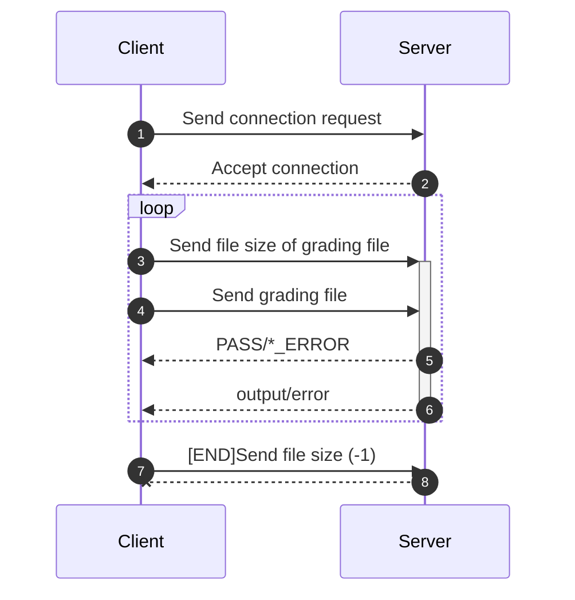
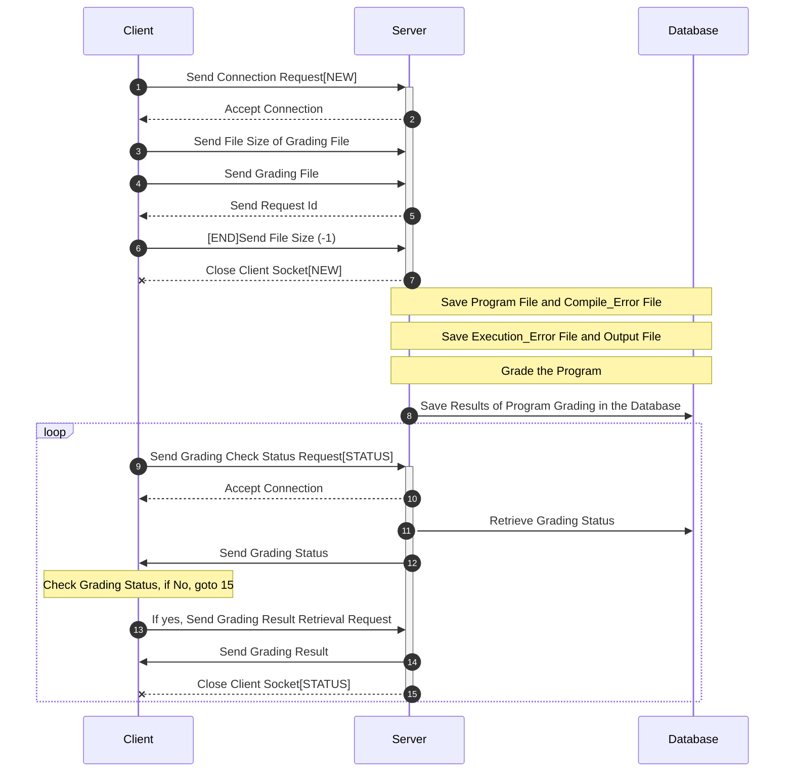

The projects aims to create a auto grader server step-by-step 

Below are the main requirements form the server and client and throughout the versions we will be upgrading the implementation 

- Version V1: Single Threaded server
- Version V2: Multi Threaded that will create new thread per request paradigm
- Version V3: Multithreaded with thread pools and requests queue.

We can assume that the purpose of the submitted program is simply to print the first ten numbers:

```
1 2 3 4 5 6 7 8 9 10
```

If the submitted program prints this output, it has passed, else it has failed. You may assume the programming language to be either C or C++. Do not assume python. 


In all versions, the server will always be run as follows,

```
$./server  <port>
```

and the client will always be run as follows, 

```
$./submit  <serverIP:port>  <sourceCodeFileTobeGraded>
```

and will get back one of the following responses from the server:

- PASS
- COMPILER ERROR
- RUNTIME ERROR
- OUTPUT ERROR

In cases 2,3,4, the server should additionally send back the error details:

- For compiler error, the entire compiler output should be sent back to the client
- For runtime error, the error type should be sent back to the client
- For output error, the output that the program produced, and the output of a ‘diff’ command  should be sent back to the client

## Version 1: Single threaded Auto-grading server 
In this version the server is a single threaded server, that does the above functionality. I.e. on receiving the source code file, it

1. Compiles it. If there is a compiler error, it sends the message and info back to the client else does the next step.
2. Run the executable. If there is a run-time error, it sends the message and info back to the client else does the next step. If it ran successfully, the output should be captured.
3. The output is compared with desired output. If not matching, send back the error and diff output. 

### Implementation details

File structure 

```C
CS744_autograder
	├── Makefile
	├── src
	│   ├── c_gradingclient.c
	│   ├── out.txt
	│   ├── s_gradingserver.c
	│   └── wrapper.cpp
	├── test_files
	│   ├── compiler_error.cpp
	│   ├── p1.c
	│   ├── program_runs.cpp
	│   └── runtime_error.cpp
	├── test.sh
	└── vanilla
		├── simple-client.c
			└── simple-server.c
```

`s_gradingserver.c` top server file, `c_gradindclient.c` is the top client code.

To run 

``` make
make
```

This will create `bin/` with all the binaries. To run the server run the following command

```
bin/server <port>
```

Now run the client 

```
bin/client 127.0.0.1:<server port> test_file/<file you want send>
```

## Milestone 2: Performance Evaluation setup for autograder server

Now we want to measure the performance of the autograder server. Our focus parameter will be `capacity`, `scalibility` and `responsiveness`. 
The aim of the load test is to test the simultaneous client handeling of the server.
And how it performance with increasing load i.e increasing `M` (clients)
To measure the performace of server with increasing load, we do a **load test**.

**Load test Setup**

The client
- send a grading request 
- wait's for response 
- then sleep for some time 
- then sends the next request 
- CONTINUE  like this

The above loop will be some `M` clients i.e. in each loop, `M` parallel client loop(request-response loop) will be active.

To quatify the above mentioned parameters, we will calculate the following meterics.
- **Throughput**: Number of successful requests/second in the experiment
- **Average Response Time** : Time taken to get the response of request sent.

### Application level protocol

Current protocol invols various packet transfer between client and server, which is shown below.

First setup the connection between Client and server. Once the connection is establised now start sending data


### Implementation details

The aim to simulate simultaneous connection. Therefore the client connect to server and within same socket connetion sends grading files
in a loop, the loop num is decided by `loopNum` variable. In between loop client sleeps for some time, controlled by sleepTimeSeconds.

After a clients runs for n number in a loop it ends connection and log the details of the connection, recording various parameter in a log 
file, in `output/connection_logs/`. The file name follow the following convention `log_<client_id>_of_<total_client>.log`. Below is the 
logged parameters of a connection 

```log
*****************Connection summary **************
avgResponseTime(sec): 8.538458
avgThroughput(resps/sec): 0.117116
Total loopCompleteTime(sec): 42.692711
numSuccessfulResp: 5
Requested: 5
```

To perform a Load test, go to `scripts` folder, and run the following command.

``` bash
./client_script.sh <port_no> <M> <loop_count> <sleep_second> ./test_files/<test_file>.cpp
```

where `M` is the parameter which control how many parallel connetion will be there.

After a sucessful run log will be generated, you can choose to run the plot script or exit.

### Final Application protocol for server




